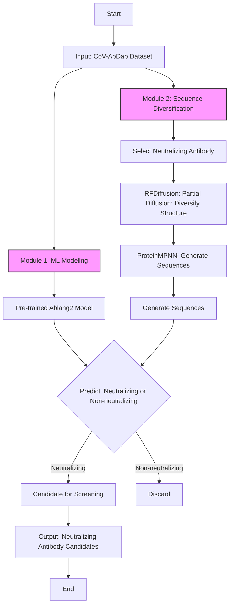
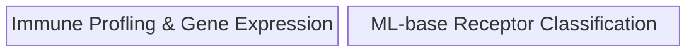

# 2024-Antibodies-and-AI

## Motivation and background
In our immune system, antibody plays an important role in identifying and neutralizing fortein invaders, such as pollen, viruses, and bacteria. These Y-shaped proteins are produced by B cells and also called immunoglobulins (Igs). The tips of the Y-shaped structure form the "variable region" or complementarity-determining regions (CDRs), which is highly specific to a particular antigen (the foreign substance). The rest of the structure, known as the "constant region," determines the antibody's class (IgG, IgA, IgM, etc.). The variable regions (CDRs) of an antibody have unique sequences and structure that bind to specific epitopes (the part of an antigen recognized by the immune system). This binding is highly specific, akin to a lock and key mechanism. Once an antibody binds to its antigen, it can neutralize the threat directly (e.g., by blocking a virus from entering cells) or mark it for destruction by other immune cells. Beyond their role in immunity, antibodies are widely used in research, diagnostics, and therapy. Monoclonal antibodies, for instance, are engineered to target specific proteins in diseases like cancer or autoimmune disorders. 

However, developing antibodies that can effectively target new or evolving pathogens is a complex and time-consuming process. Traditionally, developing effective antibodies is a labor intensive process and often need to screen thousands of potential antibodies to find ones that effectively bind to and neutralize a target pathogen. By leveraging the AI, we aim to accelerate the discovery and optimization of antibodies. 

## Workflow chart for AI-Driven Antibody Design: Enhancing CoV-AbDab with Diffusion Models and Machine Learning

Work will build on:
- [A Gentle Introduction to ML/AI as Applied to Antibody Engineering](https://github.com/NCBI-Codeathons/mlxai-2024-team-smith)
- [2023 Immune-profiling](https://github.com/AntibodyEngineers/2023-immune-profiling)
- [2022 COVID-not-COVID](https://github.com/AntibodyEngineers/2022-covid-not-covid)

For getting started with Jetstream see: [getting started](/getting-started.md)  
For adventures after getting started see: [caveats](/caveats.md)  

## Projects

Citations:  
Hackathons are funded by the National Science Foundation DUE 2055036

Work utalized the Jetstream2 resource:  
David Y. Hancock, Jeremy Fischer, John Michael Lowe, Winona Snapp-Childs, Marlon Pierce, Suresh Marru, J. Eric Coulter, Matthew Vaughn, Brian Beck, Nirav Merchant, Edwin Skidmore, and Gwen Jacobs. 2021. “Jetstream2: Accelerating cloud computing via Jetstream.” In Practice and Experience in Advanced Research Computing (PEARC ’21). Association for Computing Machinery, New York, NY, USA, Article 11, 1–8. DOI: https://doi.org/10.1145/3437359.3465565

Timothy J. Boerner, Stephen Deems, Thomas R. Furlani, Shelley L. Knuth, and John Towns. 2023. ACCESS: Advancing Innovation: NSF’s Advanced Cyberinfrastructure Coordination Ecosystem: Services & Support. “In Practice and Experience in Advanced Research Computing (PEARC ’23)”, July 23–27, 2023, Portland, OR, USA. ACM, New York, NY, USA, 4 pages. https://doi.org/10.1145/3569951.3597559

This work used Jetstream2 at Indiana University through allocation BIO220105 from the Advanced Cyberinfrastructure Coordination Ecosystem: Services & Support (ACCESS) program, which is supported by National Science Foundation grants #2138259, #2138286, #2138307, #2137603, and #2138296
