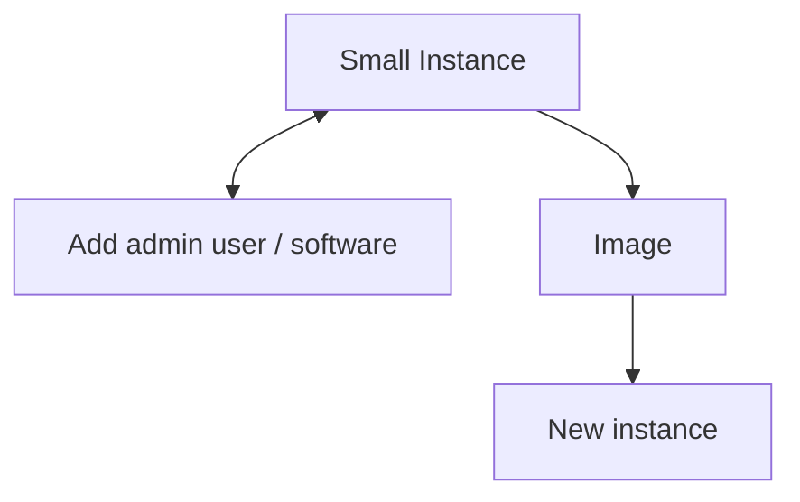

Basic commands and websites for building a Jetstream instance from sctratch. Given Jetstream's flexibilty in creating images, instances, and resizing, a strategy to conserve SUs is to create a small instance (one cpu) and install the software and core users (admin). SUs are charged by the number of cores X hours they are run. In other words, a single CPU instance on a 200,000 SU allocation can be run for 200,000 hours. That's a lot of hours. 

An image can be created from this instance and later used to launch new instances for projects. These new instanced can be much larger, up to 64-cpus. If more than 20GB are needed to installing software, the next "size" that accomidates larger boot disks is eight CPUs. Larger boot disks can be specified, but they will count against the standard 1TB disk allocation. The defalt boot disk does not subtract from allocations, hence it is desirable to use the defaults. 

Architecture



# Create an instance
1. In the allocation overview, select Create > Instance from the Create Menu
2. Select an OS Ubuntu / RedHat
3. Select a Flavor (cpus, ram, root disK). Override root disk if desired
4. The instance can be used to create an image that can be a base for addtional instances
5. On the Instance Page, Allocation Name > Instances > Instance Name select Image from the Actions menu
   
Ubuntu 22 (defualt) has python 3.10.22 and pip 22.0.2, apt-get is also installed. 
# Configure the instance
## Add Users
1. Login via the exouser account - ssh id and password are on the instance page
2. Use the sudo adduser commands (see: https://linuxize.com/post/how-to-create-users-in-linux-using-the-useradd-command/) to add the admin user. Login as exouser (name, passwd are on the configuration parameters page). Start with setting the default shell for users:
   ```
   sudo useradd -D -s /usr/bin/bash
   ```
   Then:
   ```
   sudo useradd -m username
   sudo passwd username # enter a password
   ```
   If need to remove user, forgot someting ...
   ```
   sudo userdel -r username # -r removes the directory, email ...
   ```
4. Add that user to the sudoers list (see: https://linuxize.com/post/how-to-add-user-to-sudoers-in-ubuntu)
   ```
   sudo usermod -aG sudo username
   ```
   Test
   ```
   su username
   sudo whoami
   ```
   should get "root"

## Core software
Goal is to have system wide packages that can be used from python command lines, the python enviroment, and jupyter notebooks. Administators (tech leads and sudoers) can install packages for other in hackathons. This way the disk does not fill with packages in individual user accounts. 

**Software:** 
1. [Python](#Python)
2. [Jupyterlab](#Jupyterlab)
3. [igBLAST](#igBLAST)
4. [Data science packages](#Data-science-packages)
5. [Issues and Learning](#Issues-and-Learning)

### Python
Python is 3.10.12, which is OK. Upgrading and (or) setting the venv was causing problems with building images and instances from those images. Simply update apt.
```
sudo apt update
```

### Jupyterlab
Want JupyterHub for multiuser system (https://jupyterhub.readthedocs.io/en/stable/tutorial/quickstart.html). The quickstart is OK, but installed JupyterHub in a users home directory. Not ideal for multiuser system. We want to have jupyter and common envorment so that users can install packages as needed and have those be avaible for all to use. This section includes a [better version](#better-version) that serves this purpose, and a [first attempt](#first-attempt) to document the kinds of rabbit holes that can be encountered.   

Followed (https://jupyterhub.readthedocs.io/en/1.2.0/installation-guide-hard.html) - gives the appropriate steps and configurations, and is what I did before. 
```
sudo python3 -m venv /opt/jupyterhub/ 
sudo /opt/jupyterhub/bin/python3 -m pip install wheel
sudo /opt/jupyterhub/bin/python3 -m pip install jupyterhub jupyterlab
sudo /opt/jupyterhub/bin/python3 -m pip install ipywidgets
sudo apt install nodejs npm
sudo npm install -g configurable-http-proxy
sudo mkdir -p /opt/jupyterhub/etc/jupyterhub/
cd /opt/jupyterhub/etc/jupyterhub/
sudo /opt/jupyterhub/bin/jupyterhub --generate-config
sudo vim jupyterhub_config.py
   # uncomment and add /lab to c.Spawner.default_url = '/lab'
   # uncoment and add True to c.Authenticator.allow_all = True (see note)

sudo mkdir -p /opt/jupyterhub/etc/systemd
sudo vim /opt/jupyterhub/etc/systemd/jupyterhub.service
   # add the lines (jupyterhub.service, below)

sudo ln -s /opt/jupyterhub/etc/systemd/jupyterhub.service /etc/systemd/system/jupyterhub.service
sudo systemctl daemon-reload
sudo systemctl enable jupyterhub.service
sudo systemctl start jupyterhub.service 
```
The service file launches jupyterhub in the background so that notebooks are always avabile when a system starts, or is restarted. 

jupyterhub.service file:
```
[Unit]
Description=JupyterHub
After=syslog.target network.target

[Service]
User=root
Environment="PATH=/bin:/usr/local/sbin:/usr/local/bin:/usr/sbin:/usr/bin:/opt/jupyterhub/bin"
ExecStart=/opt/jupyterhub/bin/jupyterhub -f /opt/jupyterhub/etc/jupyterhub/jupyterhub_config.py

[Install]
WantedBy=multi-user.target
```
Note: At first could not log in needed to uncomment and set: c.Authenticator.allow_all = True

### igBLAST
#### Installing igBLAST
For immune profiling projects starting with raw sequence data, igBLAST is used for the aligning and annotating ig sequences to reference data. Installations steps
1. Get the latest prebuilt binaries @ https://ftp.ncbi.nih.gov/blast/executables/igblast/release/LATEST/ 
2. Add to the jetstream base instance. Use upload in jupyter notebook to load into home dir, unpack and prepare for others to run:
```
tar -xvf ncbi-igblast-VERSION-x64-linux.tar.gz # do this in homedir so owner is the admin
sudo mv ncbi-igblast-VERSION /usr/local/ # move the dir to a central place
sudo cp ncbi-igblast-VERSION/bin/* /usr/local/bin
sudo mv ncbi-igblast-VERSION igblast # simplifies things (see below)
cd; igblastn -h # test, should get usage 
```
3. Prepare the reference database (TBD, see https://digitalworldbiology.com/blog/how-bioinformatician-odysseus)
4. Set enviorment variables - igBLAST gotchas
add c.Spawner.environment = {'IGDATA': '/usr/local/igblast'} to /opt/jupyterhub/etc/jupyterhub/jupyter_config.py:
```
sudo systemctl restart jupyterhub.service # load the updated file
```
Test. Login via jupyter, igblast-test.fa is 500 squences from previous work.  
```
import os
cmd = 'igblastn \
    -germline_db_V $IGDATA/igblastdbs/IGV \
    -germline_db_D $IGDATA/igblastdbs/IGD \
    -germline_db_J $IGDATA/igblastdbs/IGJ \
    -auxiliary_data optional_file/human_gl.aux \
    -query igblast-test.fa \
    -outfmt 19 \
    -num_threads 1 \
    -out igblast-test.txt'
os.system(cmd)
```
Should run without error. Navigate the data via pandas. 
```
import pandas as pd
df = pd.read_csv('igblast-test.txt',sep='\t')
df.shape
```
Should give (500, 96).

Notes:
- A common error is "Germline annotation database human/human_V could not be found in [internal_data] directory." This results from IGDATA not being set correctly. In the past I had IGDATA='/usr/local/igblast/bin' and moved internal_data and optional_file into the bin dir, which seems odd. This time, after encountering the error, again, I set IGDATA='/usr/local/igblast' and kept internal_data and optional_file in place. Works fine.
- igblast dbs are in /usr/local/igblast/igblastdbs, but they can be anywhere as long as their path is specified.
- if running igblastn from the command line, the IGDATA enviorment variable needs to be set
```
export IGDATA='/usr/local/igblast'
```
To add it to .bashrc for future logins
```
echo export IGDATA='/usr/local/igblast' >> .bashrc
source .bashrc
```

#### Reference Sequences
igBLAST compares sequences from immuneprofiling to reference V, J, D, sequences from Ig and TCR genes that are optained from the IGMT (ImMunoGeneTics, https://www.imgt.org) International Immunogenetics Information System. The IGMT currates these data for many different species and are available at: https://www.imgt.org/vquest/refseqh.html#VQUEST. Our hackathon focuses on human data and the respective sequences are downloaded using the curl program.
```
curl https://www.imgt.org/download/V-QUEST/IMGT_V-QUEST_reference_directory/Homo_sapiens/IG/IGHV.fasta > IGHV.fasta
curl https://www.imgt.org/download/V-QUEST/IMGT_V-QUEST_reference_directory/Homo_sapiens/IG/IGHD.fasta > IGHD.fasta
curl https://www.imgt.org/download/V-QUEST/IMGT_V-QUEST_reference_directory/Homo_sapiens/IG/IGHJ.fasta > IGHJ.fasta
curl https://www.imgt.org/download/V-QUEST/IMGT_V-QUEST_reference_directory/Homo_sapiens/IG/IGKV.fasta > IGKV.fasta
curl https://www.imgt.org/download/V-QUEST/IMGT_V-QUEST_reference_directory/Homo_sapiens/IG/IGKJ.fasta > IGKJ.fasta
curl https://www.imgt.org/download/V-QUEST/IMGT_V-QUEST_reference_directory/Homo_sapiens/IG/IGLV.fasta > IGLV.fasta
curl https://www.imgt.org/download/V-QUEST/IMGT_V-QUEST_reference_directory/Homo_sapiens/IG/IGLJ.fasta > IGLJ.fasta
```
Next, data need to be formated for igBLAST using edit_imgt_file.pl
```
edit_imgt_file.pl IGHV.fasta > IGHV.ncbi.fasta
edit_imgt_file.pl IGHD.fasta > IGHD.ncbi.fasta
edit_imgt_file.pl IGHJ.fasta > IGHJ.ncbi.fasta
edit_imgt_file.pl IGKV.fasta > IGKV.ncbi.fasta
edit_imgt_file.pl IGKJ.fasta > IGKJ.ncbi.fasta
edit_imgt_file.pl IGLV.fasta > IGLV.ncbi.fasta
edit_imgt_file.pl IGLJ.fasta > IGLJ.ncbi.fasta
```
The final steps are to combine V and J files, convert to blastdbs and move the dbs to a central location for runing igBLAST
```
cat IGHV.ncbi.fasta IGKV.ncbi.fasta IGLV.ncbi.fasta > ../blastdbs/IGV
cat IGHJ.ncbi.fasta IGKJ.ncbi.fasta IGLJ.ncbi.fasta > ../blastdbs/IGJ
cat IGHD.ncbi.fasta > ../blastdbs/IGD
cd ../blastdbs
makeblastdb -parse_seqids -dbtype nucl -in IGV
makeblastdb -parse_seqids -dbtype nucl -in IGD
makeblastdb -parse_seqids -dbtype nucl -in IGJ
```
#### fastp, input data
Input data, in fastq format, often needs to be merged and trimmed proir to annotating with igBLAST. This is due to the nuances of how the data are collected. The program fastp, available at (https://github.com/OpenGene/fastp), is often used for this purpose. Prebuilt binaries (centOS/Ubuntu) can be installed via:
```
wget http://opengene.org/fastp/fastp
chmod a+x ./fastp
sudo mv /usr/local/bin # make avaiable for all
```
Example usage of triming data with q values below 30, keeping reads longer than 80 nts, followed by merging the forward and reverse reads and converting data format from fastq to fasta:
```
fastp -i SRR4431764_1.fastq -I SRR4431764_2.fastq -o SRR4431764_1t.fastq -O SRR4431764_2t.fastq -q 30 --length_required 80 --cut_tail --cut_front --cut_mean_quality 30
fastp -i SRR4431764_1t.fastq -I SRR4431764_2t.fastq -m --merged_out SRR4431764merged30t.fastq
paste - - - - < SRR4431764merged30t.fastq | cut -f 1,2 | sed 's/^@/>/' | tr "\t" "\n" > SRR4431764merged30t.fa
```

### Data science packages
Log into JupterLab - via URL:8000, start a notebook. 

Test via import sys and pip. Pip returns
```
Usage:   
  /opt/jupyterhub/bin/python3 -m pip <command> [options]

Commands:
  install                     Install packages.
  download                    Download packages.
  uninstall                   Uninstall packages.
...
```
Test install pip install pandas - failed do to permission errors. Fix with:
```
cd /opt/jupyterhub/lib/python3.12
sudo chmod -R a+w site-packages/
sudo chmod -R a+w /opt/jupterhub # is more complete, some packages install docs in other dirs. 
```
Fixes, -R needed to make site packages fully writable. While the above has potential security issues, it should be OK for hackathon work in a virtual instance. In this way all team members can install packages as they work. 

### Issues and Learning
#### First Jupyter Attempt 
First attempt with jupterhub. Had issues with apt-get. Went away by starting with 'sudo apt update', (see above).

First need Node.js and npm 
Need to start with a sudo apt update?
```
sudo apt-get install nodejs npm # Gives a buch of 404 errors, this was fixed with sudo apt update
sudo apt install nodejs --fix-missing # works, and see above
sudo apt install npm --fix-missing # does not work, lots of 404 errors, fixed with above
sudo apt remove nodejs : removes the apt installed package
```
Instead installed NVM (https://github.com/nvm-sh/nvm?tab=readme-ov-file#installing-and-updating)
```
curl -o- https://raw.githubusercontent.com/nvm-sh/nvm/v0.39.7/install.sh | bash
export NVM_DIR="$([ -z "${XDG_CONFIG_HOME-}" ] && printf %s "${HOME}/.nvm" || printf %s "${XDG_CONFIG_HOME}/nvm")"
[ -s "$NVM_DIR/nvm.sh" ] && \. "$NVM_DIR/nvm.sh" # This loads nvm
```
NVM installed, next 
```
nvm install node
```
Installs node and npm 
```
python3 -m pip install jupyterhub
npm install -g configurable-http-proxy
python3 -m pip install jupyterlab notebook  # needed if running the notebook servers in the same environment
``` 
Installs JupyterHub, but this, and the node stuff, are in my home dir, not desired, see above. When the desired install was complete, I deleted the jupyter and .node-dirs (.nvm, .npm)

#### Upgrading python/pip, breaking images
latest greatest (06/12/2024) is 3.12.4
Thought, why not upgrade?
Update Python and pip via (https://www.howtogeek.com/install-latest-python-version-on-ubuntu/)
```
sudo apt update
sudo add-apt-repository ppa:deadsnakes/ppa
sudo apt install python3.12
sudo update-alternatives --install /usr/bin/python3 python3 /usr/bin/python3.12 1 # sets the defualt to 3.12
```
Test
```
python3 -V
```
Should get "Python 3.12.4", or whatever is the latest 3.12.

Note: pip will give an error: ModuleNotFoundError: No module named 'distutils'. This is due the fact that distutils was deprecated in python 3.10 and removed in 3.11 or 3.12 and has not been dealt with appropriately yet. Lots of slashdots on this. 
To update pip run:
```
sudo python3.10 -m pip install --upgrade pip
```
sudo apt install python3.12-venv (below) fixed other issues
sudo python3 -m venv /opt/jupyterhub/ # returned an error: Command '['/opt/jupyterhub/bin/python3', '-m', 'ensurepip', '--upgrade', '--default-pip']' returned non-zero exit status 1.
sudo apt install python3.12-venv # fixes (https://stackoverflow.com/questions/69594088/error-when-creating-venv-error-command-im-ensurepip-upgrade-def)

BUT, setting the python enviorment in this way has serious reprocussions. Specifically, once this is done and an image is created, one cannot build an instance from that image. The advice from tech support was *don't mess with global python environments.* 


